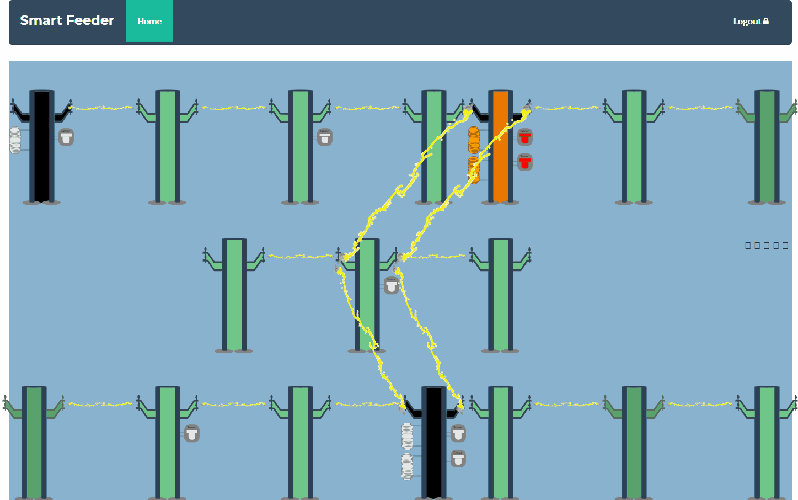
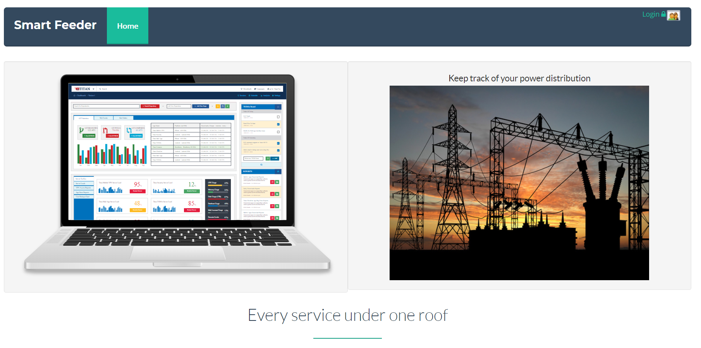
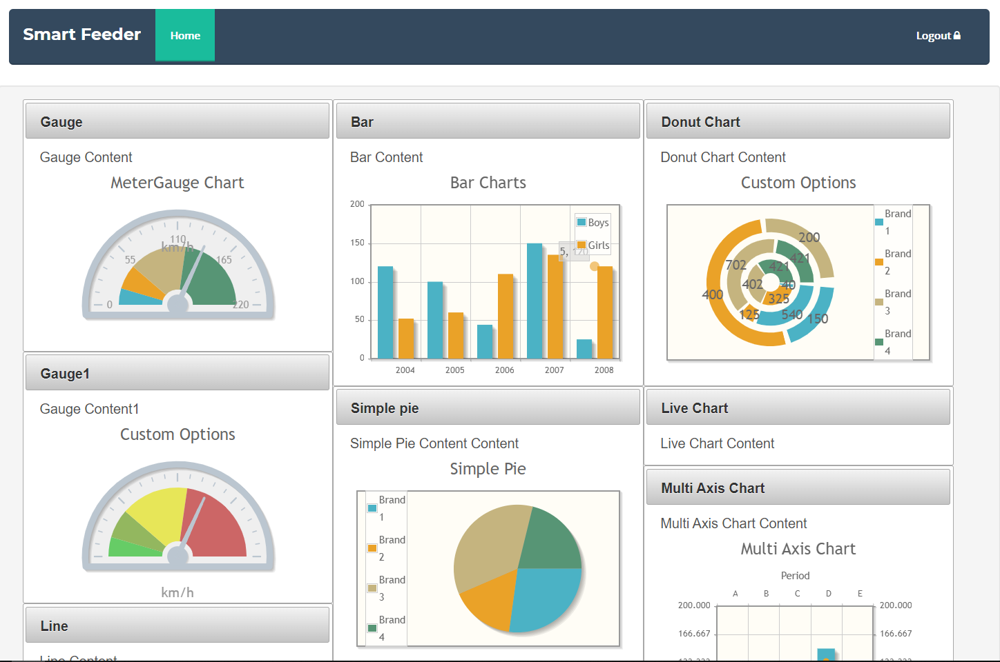
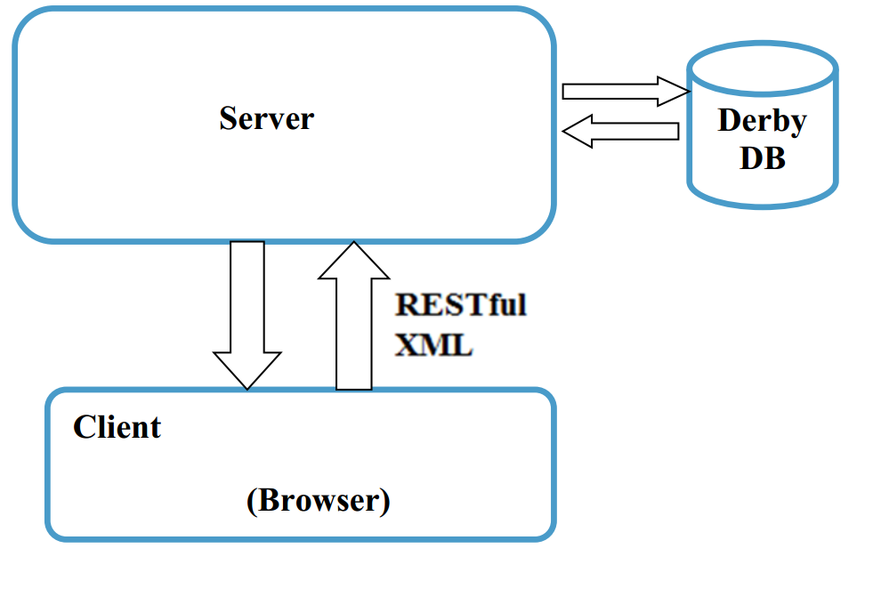

# Smart Feeder and Energy Manager (SFEM)

## Description
An advanced, Web-based monitoring and troubleshooting system that keeps 24-hour watch on a electric power distribution feeder system. This application targets the power utilities which generates, transmits and distributes electric
power. The system allows configuring the layout of a particular feeder which needs to be monitored. The application notifies the engineer or lineman if there is a fault occurred in the FEEDER which can be caused by overload, broken electric poles or conductors and ground faults. This will enable the engineer or
lineman to immediately act on the situation and rectify the faults.

This project is evolved from an idea to utilize the wide application of information technology to the energy sector.

## Architecture

SFEM is a dynamic web application which uses server oriented architecture
(SOA). The application design is strictly following the object oriented design principles and the classes are open for extension and closed for modifications.
The architecture is designed in such a way that it is easily pluggable to different databases. The application is designed in such a way that both energy manager and smart feeder uses the same framework
